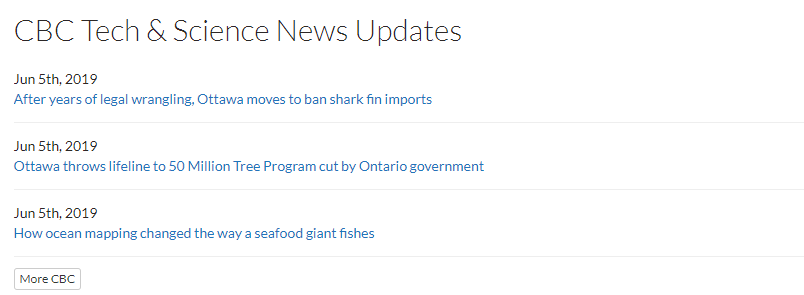
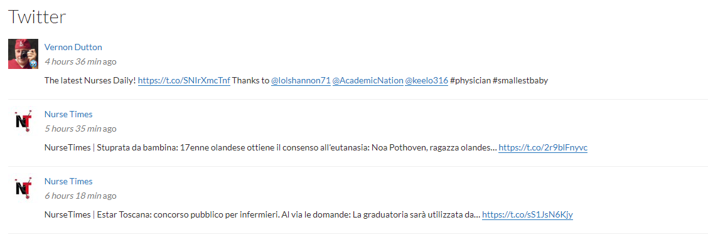
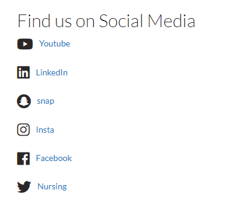
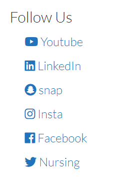

# Social Media/Feeds

### S5 - Live feed

With this view you can display RSS feeds from external websites. It displays the dates the articles were posted \(in descending order\) and the title of the article.

### S5 - Live Feed \(Twitter\)

With this view you can display tweets from a twitter account. It shows the account name, how long ago the tweet was posted, the tweet details

### S3 - Follow us - Icons only

This view displays all the icons for the social media accounts added on the site.

### S4 - Follow us - Icons and names

This view displays all the icons and names for the social media accounts added on the site.

### S6 - Social media directory

This view displays all the icons and names for the social media accounts added on the site.

