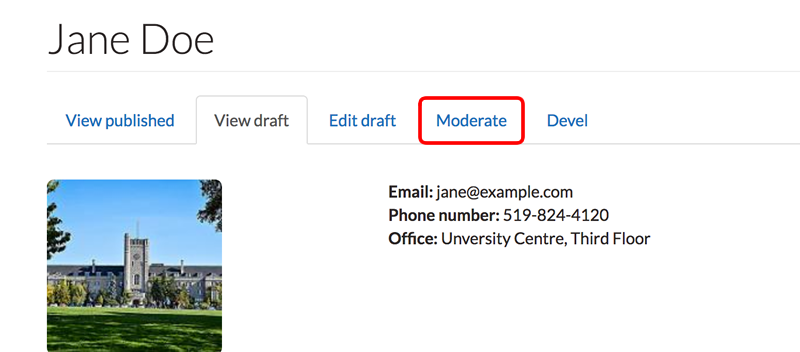

# Workbench Moderation

Workbench moderation introduces the concept of **states** to Drupal content and then using permissions user roles determine who may change a content from one state to another and ultimately publish web pages.

### Publishing States

There are 3 publishing states:

* Draft
* Needs Review
* Published

Content may be in one of these states during the publishing process. Not until the content reaches the **published** state is it view-able publicly.

### Content State Transitions

Workbench uses roles to define publishing permissions. For People Profiles, two roles have been defined: the **author** and the **publisher**.

Content may move from one state to another. Below are the transitions permitted for _People Profile_ content and the required minimum role to perform transition.

| State transition | Required role |
| :--- | :--- |
| Draft → Needs Review | Author/Editor |
| Needs Review → Draft | Author/Editor |
| Needs Review → Published | Publisher/Site manager |
| Draft → Published | publisher/Site manager |

The **author/editor** role has permissions to create new profile content as drafts, create new drafts of existing content, and submit the draft content for review before publishing. The author may also 'take back' a **Needs Review** request and change the state back to draft.

The **publisher** role has permissions to review draft content that has been submitted for review and then publish the content.

It is worth noting that once a document is publish the Workbench workflow is complete. It is not possible to move published content back to draft.

## Using Workbench Moderation

In general, content edits \(or drafts\) will be created, submitted for review and then published. These activities along with the primary role responsible for each are listed below.

| Activity | Primary role |
| :--- | :--- |
| [Create draft](workbench-moderation.md#creating-a-draft) | Author/Editor |
| [Submit draft for approval](workbench-moderation.md#submit-draft-for-approval) | Author/Editor |
| [Approve draft and publish](workbench-moderation.md#publish-document) | Publisher/Site manager |

### Creating a draft

Draft content is created by two methods.

1. When new content is created: When new content is created, it is set to a **draft state** by default.
2. The second is by editing existing content.

### Create new draft from existing content

1. Visit the page you wish to edit. From the page click the **New draft** tab to open the edit page.
2. Make changes to the page. Saving these changes will keep the page in the **Draft** state \(the default state for all new drafts\).
3. If the page is saved as a draft then the next time you visit the page the **New draft** tab will be replaced by 2 new tabs: **View Draft** and **Edit Draft**

   

4. Use the **View published** and **View draft** tabs to review changes in the content.
5. Use the **Edit draft** tab to edit the draft and make further changes to the content.
6. Save draft when edits are complete.

### Submit draft for approval

Once an Author's draft is complete they may submit it for review.

1. Click the Moderate tab to go to the moderation window:

   

2. The moderation window shows the current published page \(green\), the current draft \(red\) and past edits \(grey\). For the draft \(red\) there will be a drop-down menu. 'Needs Review' will be selected automatically in the drop-down menu.

   

3. Click **Apply** button. This will send a notification to the publisher/site managers that the draft is ready for review and needs publishing.

### Publish document

1. Visit 'My Workbench'
2. Visit 'Needs Review' tab
3. Select page that needs review by clicking 'View Moderation History'
4. The current draft that needs review will be marked in red

   

5. click 'View' to see the review the draft.
6. If satisfied, return to moderate window by selecting the 'Moderate' tab

   

7. The state drop-down menu should already be set to **Published**.

   

8. Click **Apply** to publish the page. The Author will be notified that the document is published.

_**\*Note about rejected edits \(Publisher\)**_

Publisher drafts may be rejected. The Publisher may make edits to any draft, but if this happens, the Publisher takes ownership of the draft and the Author will not be able to make any additional changes.

To avoid preventing the Author from being able to make additional changes, the Publisher may notify the Author \(outside of Drupal, ie. email or phone\) to ask them to edit their "Needs Review" draft and then resubmit for review.

### Changing Needs Review to Draft \(Author/Editor\)

In the event a draft is rejected by a Publisher/Site manager or an Author/Editor wishes to make additional changes to submitted draft, an Author/Editor may change the state of page from **Needs Review** back to **Draft**.

1. Select the **My Workbench** link from the black admin menu at the top of the page. This will open the My Workbench view.
2. From My Workbench click the **Needs Review** tab to show the list of pages sent for review.

   

3. From the **Needs Review** admin page, click the link **Change to** _**Draft**_ to set the page back to Draft.

   

4. Edit the draft as before. See [Create Draft](workbench-moderation.md#creating-a-draft) section of help for more information.

