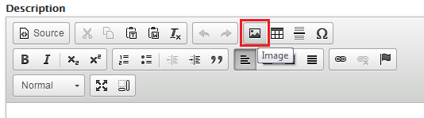

#  WYSIWYG Editor
The content editor has a collection of tools located at the top of the main Body/Description, useful to edit and customize format of the contents. *WYSIWYG* stands for What You See Is What You Get.

## Adding Images Within the Body Section
1. Goto the **Body** section of the page.
2. From the WYSIWYG Editor click on the image icon.

3. And then click `Browse Server`.

4. If image isn't already uploaded to your filesystem select upload from the menu bar.

4. Select your desired image and then click .
5. Unless the image is decorative it is **mandatory** to add Alternative Text.
6. `Width`, `Height` and `Border` settings should be blank.
7. Select the `Advanced` tab setting and modify the following properties:
    * Stylesheet Class to *img-responsive*. **Required**
8. Select OK and your image should be inserted.

## Adding Tables
The **WCAG 2.0** standard for table settings dictates that table markup must be properly structured to differentiate and properly link between header and data cells.

1. Click on Table Icon[image] in the WYSIWYG editor.
2. Enter the number of columns and rows.
3. It is **mandatory** to set the following *Table Properties* to blank values:
    * `Border Size` *blank*
    * `Width` *blank*
    * `Height` *blank*
    * `Cell Spacing` *blank*
    * `Cell Padding` *blank*
4. Add a `Caption` if a title is not provided elsewhere.
5. Adding a `Summary` is optional but recommended if the table is complicated and information not provided elsewhere.
6. Ensure `Alignment` is set to *< not set >*.
7. Select the `Advanced` tab and modify the following Properties:
    * Stylesheet Class: *table table-responsive* **required** as well.
8. Hit `OK` and begin entering your data.

*Note: To modify an existing table right-click on a cell in the table and additional options will be displayed.*

## Adding a Link
The **WCAG 2.0** standard for links dictates that the purpose of each link can be determined by the link text alone.

*Example* Do not use:
>To search the internet click [here](www.google.ca).

Use this format instead:
>[Visit Google's webpage](www.google.ca).

To do this in the **body** section:

1. Highlight the text to use for the link.
`show image of highlighted text`
2. Click on the Link icon (in the Editor).
`insert image of link icon`
3. Insert the URL that you want to link to:
    1. External links - use a link copied from the browser *i.e. www.uoguelph.ca*.
    2. Internal links - use the page name copied from the browser *psychology/faq-page* and ensure the protocol is selected to < other >

For more details, refer to the quick reference [How to Meet WCAG 2.0.](http://www.w3.org/WAI/WCAG20/quickref/)
