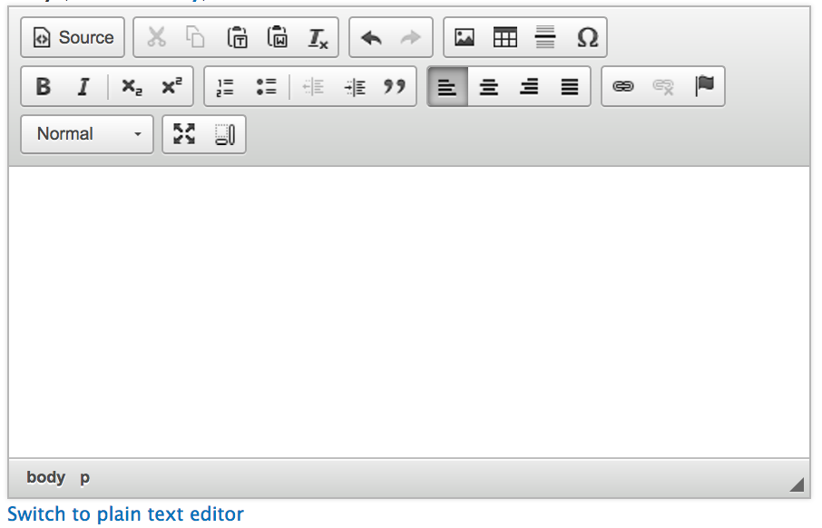
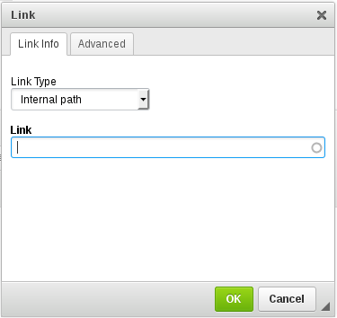
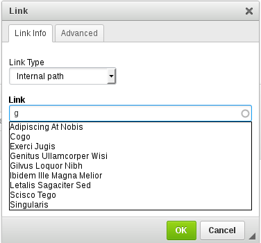

#  Drupal Text (WYSIWYG) Editor

Drupal provides its users with a simple text editor that is universal amongst all content types. The Drupal Text Editor (A.K.A the WYSIWYG Editor) allows users to add their custom content to the page through its collection of tools. *WYSIWYG* stands for What You See Is What You Get - which is the merit in which the Drupal.

Here is what you are able to do using the Drupal Text (WYSIWYG) Editor:
* Inserting an Image
*
*

Here is what the Drupal Text (WYSIWYG) Editor looks like this:

## Buttons on the Drupal Text (WYSIWYG) Editor
### First Row
* **Source**: Allows the user to input raw HTML and CSS. Commonly used for adding content from the [Style Guide](styleguide.md) into your content.
* **Cut (Scissors)**: Acts like your basic cut functionality in word.
* **Paste (Papers)**: Acts like your basic paste functionality in word.
* **Paste as Plain Text (Clipboard with T)**: Pastes entered content into the editor and removes **ALL** text styling.
* **Paste as "Plain Text" from Word (Clipboard with W)**: Pastes entered content into the editor and removes text styling but keeps formatting.
* **Remove Existing Text Formatting (Tx)**: Removes styling from selected text.
* **Undo & Redo (Arrows)**: Undo / Redo the most recent action done in the editor.
* **Insert Image (Image Icon)**: Allows the user to insert an image.
* **Insert Table (Table Icon)**: Allows the user to insert an image.
* **Insert Thematic Break (Horizontal Line)**: Produces a horizontal line in your content. Most collonly used for seperating different sections within a page. 
* **Insert Special Character (Omega Symbol)**: Allows the user to insert special characters into the page. (Eg: &, $ or %)

### Second Row
* **Bold & Italics (B and I)**: Bold and Italic selected text. Similar functionality to word.
* **Subscript and Superscript (X lower 2 & X upper 2)**: Subscript and superscript text. Similar functionality to word.
* **Numbered List (Numbered List Icon)**: Create a numbered list or place selected items into a numbered list. Similar functionality to word.
* **Unordered List (Unordered List Icon)**: Create an unordered list or place selected items into an unordered list. Similar functionality to word.
* **Decrease Indent (Increase Indent Icon)**: Decrease an existig indent on selected text. Similar functionality to word.
* **Increase Indent (Decrease Indent Icon)**: Indent selected text. Similar functionality to word.
* **Insert Block Quote (Quotation mark)**: Create a block quote or place selected information into a block quote. For more information on block quote check out the [Official Bootstrap Style Guide](http://v4-alpha.getbootstrap.com/content/typography/#blockquotes).
* **Text Allign (Left, Center, Right, Justify)**: Allign selected text. Similar functionality to word.
* **Create Hyperlink (Paperclip)**: Allows the user to Hyperlink selected text.
* **Remove Hyperlink (Paperclip with x)**: Allows the user to remove a hyperlink from text. Similar functionality to word.
* **Create Anchor (Flag)**: Allows the user to create a text anchor. [More information about anchors]() below.

### Third Row
* **Text Sizing Dropdown Menu**:
* **Full Screen Text Editor**:
* **Show Blocks (Vertical and Horizontal Lines)**:

## Inserting an Image
1. Goto the **Body** section of the page.
2. From the WYSIWYG Editor click on the image icon.

3. And then click `Browse Server`.

4. If image isn't already uploaded to your filesystem select upload from the menu bar.

5. Select your desired image and then click .
6. Unless the image is decorative it is **mandatory** to add Alternative Text.
7. Select OK and your image should be inserted.

## Aligning Images
1. Click to select the image.
2. From the *Styles* dropdown, select one of the following styles:
    - *Image on Left*
    - *Image on Right*
    - *Image Centered*

## Inserting a Table 
The **WCAG 2.0** standard for table settings dictates that table markup must be properly structured to differentiate and properly link between header and data cells.

1. Click on Table icon in the WYSIWYG editor.
2. Enter the number of columns and rows.
3. Add a `Caption` if a title is not provided elsewhere.
4. Adding a `Summary` is optional but recommended if the table is complicated and information not provided elsewhere for screen readers.
5. Hit `OK` and begin entering your data.

*Note: To modify an existing table right-click on a cell in the table and additional options will be displayed.*

## Creating and Removing Hyperlinked Text/Images
The **WCAG 2.0** standard for links dictates that the purpose of each link can be determined by the link text alone.

*Example* Do not use:
>To search the internet click [here](www.google.ca).

Use this format instead:
>[Visit Google's webpage](www.google.ca).

To do this in the **body** section:

1. Highlight the text to use for the link.
`show image of highlighted text`
2. Click on the Link icon (in the Editor).
`insert image of link icon`
3. Insert the URL that you want to link to:
    1. External links
        - Select **Link type:** *URL*
        - use a link copied from the browser *i.e. www.uoguelph.ca*.
    2. Internal links
        - **Using Link type: Internal path** (the default)
            - type the first few characters of the page name in the *Link* field 
            - select the page you want to link from the list of suggestions 
            - click *OK*
        - **Using Link type: URL**
            - use the page name copied from the browser *content/sample-page-one* and ensure the protocol is selected to < other >
